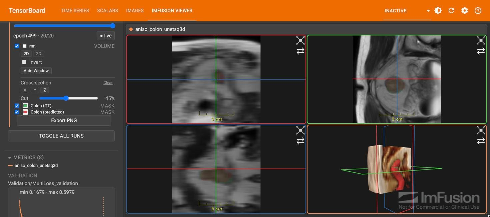
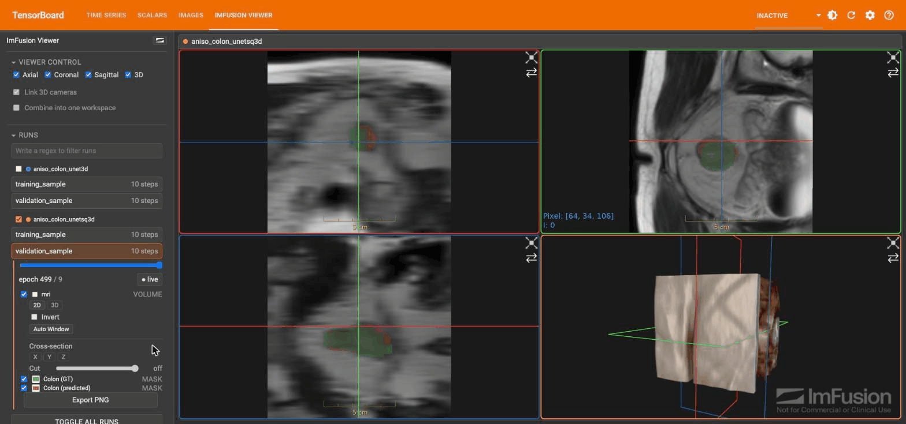

# ImFusion TensorBoard Viewer Plug-in

A TensorBoard plugin (Python package name: `imfusion-tensorboard`)
for visualizing per-epoch training outputs from ImFusion-based pipelines.
Training code writes named **cases**, each made up of one or more named
**layers** (3D volumes, segmentation masks, meshes, or 2D images); the
plugin renders those as toggleable overlays using ImFusion's WebSDK,
alongside a Metrics dashboard for comparing scalars across runs.

The plugin ships as a single, self-contained Python wheel - the compiled
frontend (including ImFusion's WebSDK wasm binary) is baked in, so
installing it needs no Node/npm.



*Ground-truth and predicted masks inside the MRI volume, cross-sectioned
in the 3D view to show both at once.*

## Getting the code

```bash
git clone git@github.com:ImFusionGmbH/imfusion-tensorboard.git
cd imfusion-tensorboard
```

## Repository layout

| Path | Contents |
| --- | --- |
| `imfusion_tensorboard_viewer/` | Python package: TensorBoard plugin, summary writers, prebuilt frontend and WebSDK wasm (`ImFusionLib.wasm`) in `static/` |
| `frontend/imfusion-viewer-plugin/` | React/TypeScript frontend sources |
| `scripts/build.sh` | Builds the wheel from the prebuilt `static/` files |
| `docs/images/` | Screenshots used in this README |

## Install

The prebuilt frontend and WebSDK wasm are committed under
`imfusion_tensorboard_viewer/static/`, so neither option needs Node/npm.

**Build a wheel and install it:**

```bash
scripts/build.sh                      # writes dist/imfusion_tensorboard-<version>-py3-none-any.whl
pip install dist/imfusion_tensorboard-*.whl
```

The wheel is self-contained, so you can copy it to other machines and
install it there with `pip install`. `scripts/build.sh` uses
`.venv/bin/python` if it exists, otherwise `python3`; set
`PYTHON=/path/to/python` to choose a different interpreter.

**Install in editable mode** (for development; Python changes take effect
without reinstalling):

```bash
pip install -e .
```

Then start TensorBoard:

```bash
tensorboard --logdir <your_logdir>
```

TensorBoard auto-discovers the plugin; no extra flags needed, except for
long/live runs (see below).

## Writing data from a training loop

```python
from imfusion_tensorboard_viewer import CaseWriter, write_case

writer = CaseWriter("runs/my_experiment")  # one per run directory

for epoch in range(num_epochs):
    write_case(
        writer,
        case="patient_001",
        step=epoch,
        layers={
            "ct_volume": {"data": ct_volume_nifti_bytes, "kind": "VOLUME", "file_extension": ".nii"},
            "segmentation_mask": {
                "data": mask_nifti_bytes,
                "kind": "MASK",
                "file_extension": ".nii",
                "color": (1, 0, 0),  # RGB
            },
        },
    )
    writer.write_scalar("loss/train", loss_value, step=epoch)

writer.close()
```

For a multi-class mask, pass `label_names={1: "liver", 2: "tumor"}` instead
of `color` - each label gets its own auto-assigned, individually
recolorable/hideable legend entry. Layers don't need a shared cadence
either: a scan written once and a prediction written every epoch is fine,
each is only requested at the steps it actually exists.

See the docstrings in `imfusion_tensorboard_viewer/summary.py` for the full
`write_layer`/`write_case`/`write_scalar` signatures.

For long-running or live training (more than ~10 epochs), also pass
`--samples_per_plugin`, or TensorBoard retains only the last ~10 steps per
layer:

```bash
tensorboard --logdir <your_logdir> --samples_per_plugin imfusion_viewer=1000
```

## Features

- **Compare runs side by side** - each checked run gets its own column;
  columns on the same case keep their 3D cameras linked (toggle **Link 3D
  cameras** to break it).
- **Combine into one workspace** - overlay several runs' layers in one
  column instead, each with its own color per layer, for direct
  side-by-side comparison without a second window.
- **Volume windowing and cross-section** - each volume gets an **Invert**
  toggle and **Auto Window** button (2D and 3D tracked independently), plus
  a **Cross-section** control that cuts the volume away along X/Y/Z to
  reveal a mask or mesh sitting inside it.



## Feedback and licensing

If the plugin doesn't fit your workflow, you have an idea for a new
feature, or you need a commercial ImFusion SDK license, email
[info@imfusion.com](mailto:info@imfusion.com).

**Not for clinical use.**
